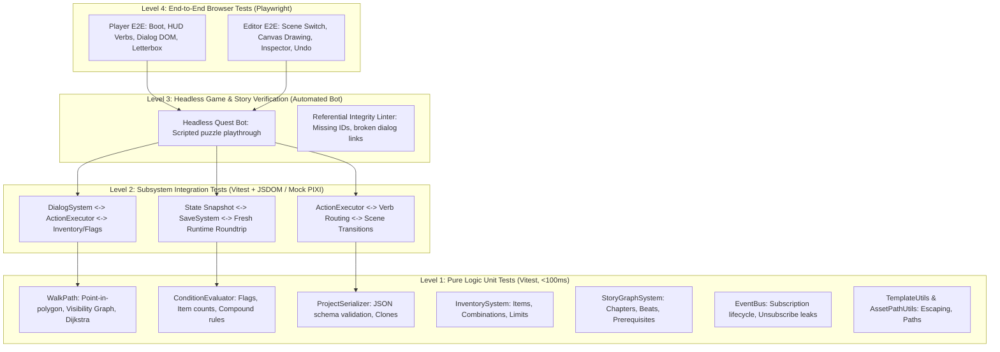

# WebQuestEngine — Comprehensive Test Strategy & Suite Design

## 1. Overview & Testing Philosophy

WebQuestEngine combines three distinct layers:
1. **Pure Game Logic & Math:** Concave polygon pathfinding, Dijkstra shortest paths, condition evaluation, inventory management, dialog tree routing, story graph transitions, and project JSON serialization.
2. **Engine Runtime Coordination:** Event handling, verb interpretation, action sequencing, camera letterboxing, and save/restore snapshots.
3. **Rendering & UI (Editor + Player):** PixiJS 8 WebGL/WebGPU sprite rendering, audio playback, HTML/DOM overlays (HUD, dialog choices, menus), and canvas polygon/bezier editing tools.

The testing strategy is designed to provide **maximum confidence and regression prevention with minimum maintenance overhead**, prioritizing deterministic, fast headless tests over brittle pixel-scraping where possible.



---

## 2. Testability & Mocking Architecture

| Subsystem | Execution Environment | Key Dependencies / IO | Mocking Strategy |
|---|---|---|---|
| **Pathfinding & Math** | Pure Node / Vitest | None | Zero mocks needed (pure math). |
| **Condition Evaluator** | Pure Node / Vitest | Flag getter function | Pass pure in-memory lookup functions. |
| **Inventory & Story** | Pure Node / Vitest | EventBus | In-memory clean `EventBus` instance per test. |
| **Project & Save Storage** | Pure Node / Vitest | `localStorage` | In-memory `localStorage` mock (built into Vitest / jsdom). |
| **Dialog System** | Vitest + JSDOM | AudioSystem, EventBus | Stub `AudioSystem.getInstance().playVoice()`; verify emitted events and choices. |
| **Action Executor** | Vitest + JSDOM | RuntimeContext, Scenes | Mock `RuntimeContext` with minimal scene mock (mock container). |
| **DOM Overlays & HUD** | Vitest + JSDOM | DOM elements, CSS | JSDOM DOM queries (`querySelector`, event dispatches). |
| **PixiJS Rendering** | Playwright (Headless Chrome) | WebGL / Canvas | Run in real browser; assert on state and DOM HUD rather than raw canvas pixels. |

---

## 3. Comprehensive Test Catalog by Category

### Category 1: Algorithmic & Geometric Unit Tests (`src/engine/scene/WalkPath.ts`)

| Test ID | Test Target | Scenario / Inputs | Expected Output |
|---|---|---|---|
| `PATH-01` | `containsPoint` | Convex polygon (square: `[0,0], [100,0], [100,100], [0,100]`), test point `(50, 50)` | Returns `true`. |
| `PATH-02` | `containsPoint` | Point outside bounding box `(150, 50)` or `(-10, 50)` | Returns `false`. |
| `PATH-03` | `containsPoint` | L-shaped concave polygon; test point inside the concavity void | Returns `false`. |
| `PATH-04` | `getScaleAt` | Given `minY=200, maxY=800, minScale=0.5, maxScale=1.5`: test `y=200`, `y=500`, `y=800`, `y=1000` | `y=200` → `0.5`, `y=500` → `1.0`, `y=800` → `1.5`, clamped at `1.5`. |
| `PATH-05` | `clampToWalkable` | Target point `(120, 50)` outside polygon | Returns closest projected point on polygon boundary edges. |
| `PATH-06` | Shortest Path | Direct line of sight between start and end within concave polygon | Returns direct 2-point path `[start, end]`. |
| `PATH-07` | Shortest Path | Concave polygon with obstacle requiring corner navigation | Returns multi-waypoint path routing around polygon vertices via Dijkstra. |
| `PATH-08` | Edge Cases | Degenerate polygon (< 3 points or colinear points) | Safe fallback (direct target or clamped target without throwing exceptions). |

---

### Category 2: Logic, Condition & Rule Evaluation

#### A. Condition Evaluator ([`ConditionEvaluator.ts`](file:///home/itaibh/Projects/PointAndClickQuestEngine/src/engine/utils/ConditionEvaluator.ts))
| Test ID | Test Target | Scenario | Expected Output |
|---|---|---|---|
| `COND-01` | `requiredFlag` | Flag set to `true` | `valid: true, reqPass: true`. |
| `COND-02` | `requiredFlag` | Flag undefined or `false` | `valid: false, reqPass: false`. |
| `COND-03` | `notFlag` | Forbidden flag is set to `true` | `valid: false, notPass: false`. |
| `COND-04` | `notFlag` | Forbidden flag is `false` or missing | `valid: true, notPass: true`. |
| `COND-05` | Compound Flags | Both `requiredFlag` and `notFlag` present | Valid only when required is true AND forbidden is false. |
| `COND-06` | Null safety | Missing `flagGetter` callback or empty condition object | Returns `valid: true` without crashing. |

#### B. Inventory System ([`InventorySystem.ts`](file:///home/itaibh/Projects/PointAndClickQuestEngine/src/engine/systems/InventorySystem.ts))
| Test ID | Test Target | Scenario | Expected Output |
|---|---|---|---|
| `INV-01` | Add Item | Add item `'iron_key'` | `hasItem('iron_key') === true`, emits `inventory:change`. |
| `INV-02` | Remove Item | Remove `'iron_key'` | Item removed, `hasItem('iron_key') === false`. |
| `INV-03` | Duplicate Addition | Add unique item twice | Stack count or deduplication matches config. |
| `INV-04` | Selected Item | Set active item `'potion'`, deselect active item | Emits `inventory:select`, active item correctly tracked. |
| `INV-05` | Combinations | Combine `'dry_cloth'` with `'oil_flask'` | Successful combination returns `'oily_rag'`, consumes constituents (if configured). |
| `INV-06` | Invalid Combine | Combine `'dry_cloth'` with `'iron_key'` | Emits failure event / no items consumed. |

#### C. Story Graph System ([`StoryGraphSystem.ts`](file:///home/itaibh/Projects/PointAndClickQuestEngine/src/engine/systems/StoryGraphSystem.ts))
| Test ID | Test Target | Scenario | Expected Output |
|---|---|---|---|
| `STORY-01` | Chapter Unlocking | Complete all prerequisite beats of Chapter 1 | Chapter 2 transitions from locked to unlocked. |
| `STORY-02` | Scene Transition Rule | Move to scene linked by active story node | Validates current scene matches graph state. |
| `STORY-03` | State Snapshot | Export story state | Includes active chapter, visited nodes, completed beats. |

---

### Category 3: Dialog Engine Subsystem (`src/engine/systems/DialogSystem.ts`)

| Test ID | Test Target | Scenario | Expected Output |
|---|---|---|---|
| `DLG-01` | Start Dialog | Call `startDialog('intro_talk')` | Emits `dialog:start`, sets `currentNode` to tree start node. |
| `DLG-02` | Linear Progression | Node without choices, click advance | Moves to target node specified by `nextNodeId`. |
| `DLG-03` | Conditional Choices | Node with 3 choices, Choice 2 has `condition: { requiredFlag: 'has_clue' }` (flag false) | Only Choices 1 and 3 are returned for rendering. |
| `DLG-04` | Choice Selection | Player selects Choice 1 (points to Node B) | Sets current node to Node B, executes on-enter action directives. |
| `DLG-05` | Action Directives | Dialog node contains `giveItem: 'spell_book'`, `setFlag: { flag: 'talked_to_mage', value: true }` | Emits inventory addition and flag updates. |
| `DLG-06` | Router Node | Enter router node with condition A (met) and condition B (unmet) | Automatically transitions to target A without presenting UI. |
| `DLG-07` | Dialog Termination | Node with `endDialog: true` or `nextNodeId: null` reached | Emits `dialog:end`, resets active dialog state, restores input mode. |

---

### Category 4: Runtime Action Execution & State Synchronization

#### A. Action Executor ([`ActionExecutor.ts`](file:///home/itaibh/Projects/PointAndClickQuestEngine/src/engine/runtime/ActionExecutor.ts))
| Test ID | Test Target | Scenario | Expected Output |
|---|---|---|---|
| `ACT-01` | Look At Hotspot | Trigger `'lookAt'` on `'statue'` with text directive | Emits actor speech bubble event or narrator box with target text. |
| `ACT-02` | Use Item on Hotspot | Active item `'key'`, click `'locked_chest'` with matching rule | Executes action rule, emits item consumption, plays unlock audio. |
| `ACT-03` | Default Fallback Rule | Use invalid item on hotspot | Plays generic refusal action ("That doesn't work."). |
| `ACT-04` | Change Scene Action | Action contains `changeScene: 'crypt', spawnPoint: {x: 200, y: 300}` | Emits `scene:change`, unloads previous scene, sets player spawn. |
| `ACT-05` | Condition Block | Action rule wrapped in condition; condition evaluates to `false` | Action block skipped, fallback executed if provided. |

#### B. Save & Restore Roundtrip ([`SaveSystem.ts`](file:///home/itaibh/Projects/PointAndClickQuestEngine/src/engine/systems/SaveSystem.ts) & [`SaveRestoreHandler.ts`](file:///home/itaibh/Projects/PointAndClickQuestEngine/src/engine/runtime/SaveRestoreHandler.ts))
| Test ID | Test Target | Scenario | Expected Output |
|---|---|---|---|
| `SAVE-01` | Snapshot Integrity | Capture snapshot with active flags `{'door_open': true}`, inventory `['key']`, hero at `(450, 600)` | Snapshot contains identical state structure. |
| `SAVE-02` | Slot Persistence | Save to slot 1, read slot 1 | Deserializes matching `SaveGameData`. |
| `SAVE-03` | State Restoration | Initialize fresh runtime, call `restoreSave(slot1Data)` | Flags, inventory, current scene, character positions, and audio volume are precisely restored. |
| `SAVE-04` | Corrupted Save Recovery | Corrupt JSON string in `localStorage` | Graceful error handling; returns null/warning instead of crashing the player. |
| `SAVE-05` | Quota Exceeded | Simulate `QuotaExceededError` on `localStorage.setItem` | Emits `save:error` user-visible alert without breaking game flow. |

---

### Category 5: Project Serialization & Referential Integrity Validation

#### A. Project Serializer ([`ProjectSerializer.ts`](file:///home/itaibh/Projects/PointAndClickQuestEngine/src/engine/storage/ProjectSerializer.ts))
| Test ID | Test Target | Scenario | Expected Output |
|---|---|---|---|
| `SERIAL-01` | Starter Project | `ProjectSerializer.createStarterProject()` | Returns valid `ProjectData` object conforming to all required fields. |
| `SERIAL-02` | Roundtrip Serialization | `serialize(project)` then `deserialize(json)` | Deep equality preserved across scenes, hotspots, walk paths, dialogs. |
| `SERIAL-03` | Malformed JSON | Deserializing string missing `scenes` or `version` | Throws descriptive error `Missing essential fields`. |

#### B. Referential Integrity Linter (Project Health Check)
This test scans any given project JSON (including `demo/the_alchemist's_mystery.json` and user-authored games) and asserts:
1. **Scene References:** Every `sceneId` referenced in story nodes, transitions, or dialogs exists in `project.scenes`.
2. **Item References:** Every item referenced in `giveItem`, `hasItem`, or hotspot use actions exists in `project.items`.
3. **Dialog Node References:** Every `nextNodeId` or choice target connects to an existing node within the same `DialogTree`. No dead-end or dangling node pointers unless explicitly marked as terminal.
4. **Character Actor References:** Every actor named in dialog nodes or cinematics exists in the scene or global character registry.
5. **Start Scene & Spawn Point:** `startChapterId` resolves to an existing chapter, which resolves to an existing scene containing a valid `playerSpawn` point.

---

### Category 6: Headless Quest Playthrough Bot (Automated Integration)

A headless simulator that executes game actions against the engine runtime without WebGL rendering, validating that the demo quest is 100% beatable from start to finish.

```typescript
// Conceptual runner script for CI
describe('Demo Quest Headless Playthrough', () => {
  it('completes The Alchemist\'s Mystery from start to finish', async () => {
    const project = loadDemoProject();
    const sim = new HeadlessGameSimulator(project);
    await sim.boot();

    // Step 1: Look at the desk
    sim.interact('lookAt', 'hotspot_alchemist_desk');
    expect(sim.lastMessage).toContain('cluttered desk');

    // Step 2: Pick up potion bottle
    sim.interact('pickup', 'hotspot_blue_flask');
    expect(sim.inventory.hasItem('item_blue_potion')).toBe(true);

    // Step 3: Talk to the Alchemist & trigger key branch
    sim.startDialog('dialog_alchemist');
    sim.chooseDialogOption('Can I help you with your experiment?');
    sim.chooseDialogOption('I found this blue potion.');
    expect(sim.flags.get('given_potion_to_alchemist')).toBe(true);

    // Step 4: Scene transition to Courtyard
    sim.walkToHotspot('door_to_courtyard');
    sim.interact('use', 'door_to_courtyard');
    expect(sim.currentScene.id).toBe('scene_courtyard');

    // Step 5: Check win condition
    expect(sim.story.isChapterComplete('ch_1')).toBe(true);
  });
});
```

---

### Category 7: Browser-Level End-to-End Tests (Playwright)

Run in real Chromium / WebKit to test DOM, layout, and user input:

| Test ID | Area | Scenario | Assertions |
|---|---|---|---|
| `E2E-01` | Player Boot | Open `/player.html` | Canvas initialized, letterbox bars computed, title banner visible. |
| `E2E-02` | LucasArts HUD | Hover over hotspot | Action sentence bar updates text: `"Walk to Door"`. |
| `E2E-03` | Verb Click | Click `"Talk to"` verb button | Active verb state highlights `"Talk to"`; cursor updates. |
| `E2E-04` | Dialog Overlay | Trigger dialog sequence | DOM dialog container appears with custom typography; choices are clickable via mouse and numeric keypresses (1, 2, 3). |
| `E2E-05` | In-Game Menu | Press `Escape` | Pause menu overlay opens, volume sliders are interactive, Save/Load slot list renders. |
| `E2E-06` | Viewport Resize | Resize browser window | `LetterboxManager` re-scales game canvas preserving aspect ratio without distortion. |
| `E2E-07` | Editor Smoke | Open `/index.html` (Studio) | Scene canvas renders, left project tree shows scenes, clicking node opens inspector. |

---

## 4. Test Tooling & Infrastructure Architecture

### Recommended Stack

1. **Test Runner:** **Vitest**
   - Native Vite integration, zero config drift with existing `vite.config.ts`.
   - Out-of-the-box TypeScript support (`esbuild`).
   - Lightning-fast HMR test execution for unit & logic tests.
2. **Environment:** **JSDOM** (via `vitest-environment-jsdom`)
   - Provides DOM APIs (`document`, `window`, `localStorage`, `HTMLElement`) required for `DOMOverlayRenderer`, `SaveSystem`, and `DialogController`.
3. **E2E Runner:** **Playwright**
   - Headless browser automation for `/player.html` and `/index.html`.
4. **Coverage:** `@vitest/coverage-v8`
   - Target thresholds: **85%+ on `src/engine/`**, focusing heavily on systems, storage, and runtime logic.

### Directory Structure

```
PointAndClickQuestEngine/
├── src/
├── tests/
│   ├── unit/
│   │   ├── scene/
│   │   │   └── WalkPath.test.ts
│   │   ├── utils/
│   │   │   ├── ConditionEvaluator.test.ts
│   │   │   └── TemplateUtils.test.ts
│   │   ├── storage/
│   │   │   ├── ProjectSerializer.test.ts
│   │   │   └── SaveSystem.test.ts
│   │   └── core/
│   │       └── EventBus.test.ts
│   ├── integration/
│   │   ├── DialogSystem.test.ts
│   │   ├── ActionExecutor.test.ts
│   │   ├── InventoryFlow.test.ts
│   │   └── SaveRestoreCycle.test.ts
│   ├── verification/
│   │   ├── ProjectIntegrity.test.ts     # Scans any project JSON for dangling IDs
│   │   └── DemoPlaythrough.test.ts     # Headless bot playthrough of demo game
│   ├── e2e/
│   │   ├── player.spec.ts              # Playwright player tests
│   │   └── editor.spec.ts              # Playwright editor smoke tests
│   └── mocks/
│       ├── PixiMock.ts                 # Lightweight stub for PIXI objects
│       └── TestProjectFactory.ts       # Helpers to generate test scenes & items
├── vitest.config.ts
└── playwright.config.ts
```

---

## 5. Phased Implementation Roadmap

```mermaid
timeline
    title Testing Rollout Plan
    section Phase 1: Pure Logic Safety Net (Day 1)
        Vitest setup : Configure vitest & jsdom
        Unit tests : WalkPath polygon & Dijkstra math
        Storage & conditions : ConditionEvaluator & ProjectSerializer
    section Phase 2: Engine Subsystems & Integrity (Days 2-3)
        Subsystems : DialogSystem branching & Inventory actions
        Project Linter : Referential integrity test on JSON
        Save roundtrip : Complete state snapshot & restore
    section Phase 3: Bot Simulation & E2E (Days 4-5)
        Headless Bot : Scripted playthrough of demo quest
        Playwright E2E : Player HUD & DOM overlays
        CI Pipeline : GitHub Actions check gate
```
